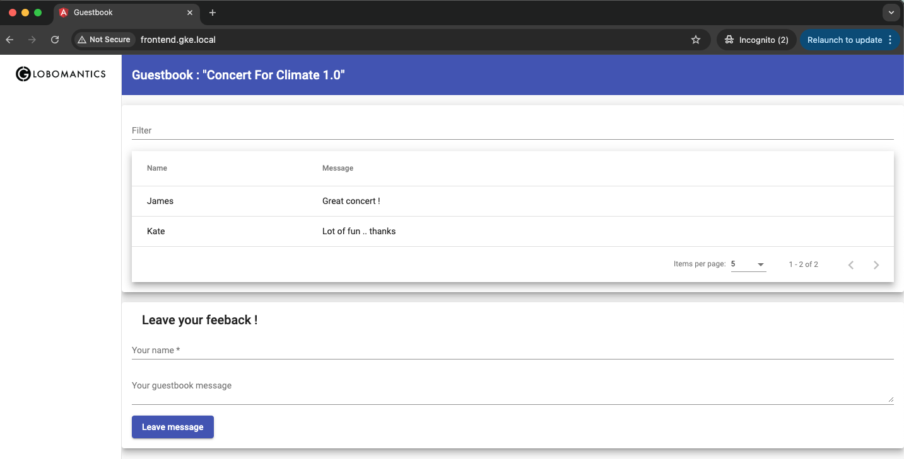
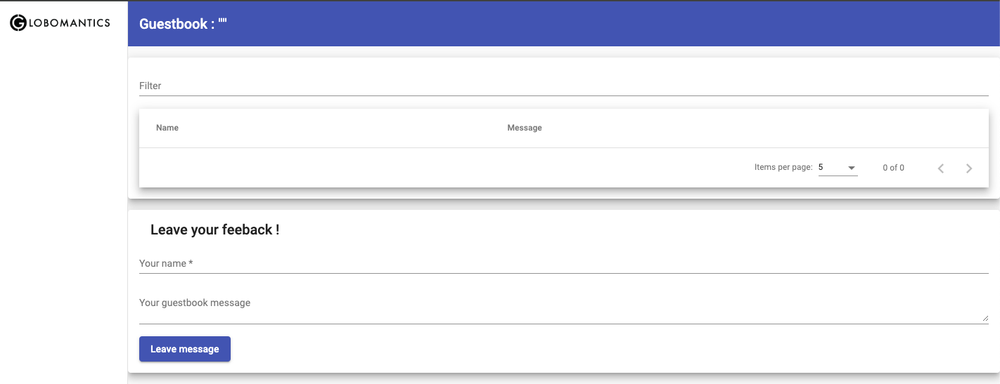

# Lab: Developing, Installing/Upgrading, Rolling Back, and Deleting a Helm Chart

## Prerequisites
- Kubernetes cluster up and running
- Helm installed

## Objectives
- Install NGINX Ingress using Helm.
- Build a Helm chart from scratch.
- Install, upgrade, and validate a Helm chart.
- Roll back changes and manage the Helm release history.
- Clean up resources after the lab.

## Steps

### Step 0: Install NGINX Ingress

1. Add the NGINX Ingress Helm repository:
   ```shell
   helm repo add ingress-nginx https://kubernetes.github.io/ingress-nginx
   helm repo update
   ```

2. Install the NGINX Ingress controller:
   ```shell
   helm install nginx-ingress ingress-nginx/ingress-nginx --namespace ingress-nginx --create-namespace
   ```

3. Verify that the NGINX Ingress controller is running:
   ```shell
   kubectl get pods -n ingress-nginx
   ```

### Step 1: Building the Helm Chart

1. Create the chart directory and templates:
   ```shell
   mkdir guestbook
   mkdir -p guestbook/templates
   cp yaml/* guestbook/templates
   ```

2. Create the `Chart.yaml` file:
   ```yaml
   # vim guestbook/Chart.yaml
   apiVersion: v2
   name: guestbook
   appVersion: "1.0"
   description: A Helm chart for Guestbook 1.0 
   version: 0.1.0
   type: application
   ```

3. Render chart templates locally and display the output:
   ```shell
   helm template guestbook 
   ```

### Step 2: Install the Chart

1. Install the `guestbook` chart:
   ```shell
   helm install demo-guestbook guestbook
   ```

2. Get the `frontend` pods:
   ```shell
   kubectl get pod -l app=frontend
   ```

3. List all of the releases:
   ```shell
   helm list
   ```

4. Fetch the generated manifest for `demo-guestbook` release:
   ```shell
   helm get manifest demo-guestbook
   ```

5. Check the ingress resource and get the external IP address:
   ```shell
   kubectl get ingress guestbook-ingress
   EXTERNAL_IP=$(kubectl get ingress guestbook-ingress -o jsonpath='{.status.loadBalancer.ingress[0].ip}')
   ```

6. Set local host file:
   ```shell
   echo "$EXTERNAL_IP frontend.gke.local" | sudo tee -a /etc/hosts
   echo "$EXTERNAL_IP backend.gke.local" | sudo tee -a /etc/hosts
   ```

7. Access the frontend Web UI at [http://frontend.gke.local](http://frontend.gke.local).

   

### Step 3: Upgrade the Helm Chart

1. Update `Chart.yaml` to version 0.1.1.

   ```yaml
   apiVersion: v2
   name: guestbook
   appVersion: "1.0"
   description: A Helm chart for Guestbook 1.0 
   version: 0.1.1 # Update to 0.1.1
   type: application
   ```

2. Update the `frontend.yaml` template with the new image.

   ```yaml
   # frontend.yaml
   apiVersion: apps/v1
   kind: Deployment
   metadata:
   name: frontend
   spec:
   replicas: 1
   selector:
      matchLabels:
         app: frontend 
   template:
      metadata:
         labels:
         app: frontend
      spec:
         containers:
         - image: ghcr.io/hungtran84/frontend:2.0 # Update to 2.0
         imagePullPolicy: Always
         name: frontend
         ports:
         - name: frontend
            containerPort: 4200
   ```
3. Upgrade the release:
   ```shell
   helm upgrade demo-guestbook guestbook
   ```

   You should see ouput like this

   ```plaintext
   Release "demo-guestbook" has been upgraded. Happy Helming!
   NAME: demo-guestbook
   LAST DEPLOYED: Tue Nov 12 17:55:38 2024
   NAMESPACE: default
   STATUS: deployed
   REVISION: 2
   TEST SUITE: None
   ```

4. Check the new image of the frontend application:
   ```shell
   kubectl describe pod -l app=frontend
   ```

   Now, UI looks a bit different

   

### Step 4: Roll Back to a Previous Revision

1. Roll back to revision 1:
   ```shell
   helm rollback demo-guestbook 1
   ```

2. Get the history of changes:
   ```shell
   helm history demo-guestbook
   ```

   **Output**

   ```plaintext
   REVISION        UPDATED                         STATUS          CHART           APP VERSION     DESCRIPTION     
   1               Tue Nov 12 17:47:34 2024        superseded      guestbook-0.1.0 1.0             Install complete
   2               Tue Nov 12 17:55:38 2024        superseded      guestbook-0.1.1 1.0             Upgrade complete
   3               Tue Nov 12 17:58:10 2024        deployed        guestbook-0.1.0 1.0             Rollback to 1   
    ```
   
   Refresh your Web UI to confirm. It should now be working with version `1.0`.
### Step 5: Clean Up

1. Uninstall the `guestbook` release:
   ```shell
   helm uninstall demo-guestbook
   ```

2. Remove the `guestbook` directory:
   ```shell
   rm -rf guestbook
   ```

## Summary

In this lab, you learned how to build a Helm chart from scratch, install and upgrade it, roll back changes, view release history, and clean up resources. You also set up NGINX Ingress to access the application via a custom domain.
