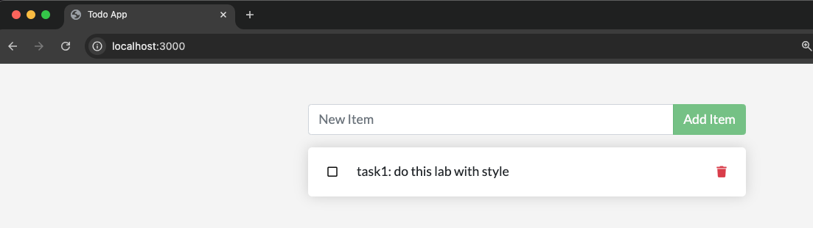

# Lab: Getting Started with the `todo` Application

## Objectives

The purpose of this exercise is to get familiar with the `todo` list app, which will be used throughout the course. This simple app is based on the [Express web framework](https://expressjs.com/), has a pluggable database for persistence, and is designed to run in containerized form.

### Prerequisites
- A working Docker installation for building container images and testing the application.
- An account with an OCI registry, such as [Docker Hub](https://hub.docker.com/) or the [GitHub Container Registry (GHCR)](https://github.com/features/packages).
- A Kubernetes cluster for deploying the application.


## Steps

### 1. Prepare the OCI Registry
#### Create a GitHub Personal Access Token (PAT)
1. Sign in to your [GitHub account](https://github.com).
2. Navigate to **Settings** > **Developer settings** > **Personal access tokens** > **Fine-grained tokens**.
3. Generate a new token with the following scopes:
   - `read:packages` (Pull images)
   - `write:packages` (Push images)
   - `delete:packages` (Optional, delete images)
   - `repo` (Optional, access private repositories)
4. Save the token securely.

#### Log In to `ghcr.io`
Use your PAT to authenticate Docker with GHCR:
```bash
echo YOUR_GITHUB_TOKEN | docker login ghcr.io -u YOUR_GITHUB_USERNAME --password-stdin
```
You should see `Login Succeeded`.


### 2. Build and Push the Application Image
1. Navigate to the app directory and inspect its contents:
   ```bash
   cd app
   ls -lR
   cat Dockerfile
   ```

   ```plaintext
    FROM node:20-alpine AS base
    ARG NODE_ENV
    ENV NODE_ENV="${NODE_ENV:-production}"
    ARG UID=node \
        GID=node
    USER $UID:$GID

    FROM base AS deps
    WORKDIR /app
    COPY --chown=$UID:$GID package.json yarn.lock ./
    RUN yarn install

    FROM base
    WORKDIR /app
    COPY --chown=$UID:$GID . .
    COPY --chown=$UID:$GID --from=deps /app/node_modules ./node_modules
    CMD ["/app/docker-entrypoint.sh"]
    ```

2. Build a container image for the application:
   ```bash
   docker build -t ghcr.io/YOUR_GITHUB_USERNAME/todo:1.0 .
   ```
3. Push the image to the OCI registry:
   ```bash
   docker push ghcr.io/YOUR_GITHUB_USERNAME/todo:1.0
   ```


### 3. Test the Application Locally
Run a container with the built image:
```bash
docker run -it --rm \
  -e SQLITE_DB_LOCATION=/tmp/todos.db \
  -p 3000:3000 \
  ghcr.io/YOUR_GITHUB_USERNAME/todo:1.0
```
Access the app in a browser at [http://localhost:3000](http://localhost:3000).



### 4. Prepare for Kubernetes Deployment
1. Navigate to the Kubernetes configuration directory and inspect the manifests:
   ```bash
   cd ../config
   cat deployment.yaml
   cat service.yaml
   ```
2. Update the `Deployment` to use your image:
   ```yaml
   - image: ghcr.io/YOUR_GITHUB_USERNAME/todo:1.0
   ```
3. If your registry is private, create a Kubernetes secret for authentication:
   ```bash
   kubectl create secret docker-registry my-secret \
   --docker-server=ghcr.io \
   --docker-username=YOUR_GITHUB_USERNAME \
   --docker-password=YOUR_GITHUB_TOKEN \
   --docker-email=your-email@example.com
   ```
   Update the Deployment to use the secret in `imagePullSecrets`.


### 5. Deploy to Kubernetes
1. Apply the configuration:
   ```bash
   kubectl apply -f .
   ```
2. Verify the application is running:
   - Check the external IP address of the Service to access the app in a browser.
   - If no external IP is assigned, use port-forwarding:
     ```bash
     kubectl port-forward services/todo 8888:3000
     ```

## Summary

In this lab, you:
- Built and pushed a containerized `todo` application to an OCI registry.
- Tested the application locally.
- Deployed the application to a Kubernetes cluster.
- Accessed the application using SQLite as the persistence layer.

The `todo` app is now running in your Kubernetes cluster, ready for further experimentation throughout the course.
