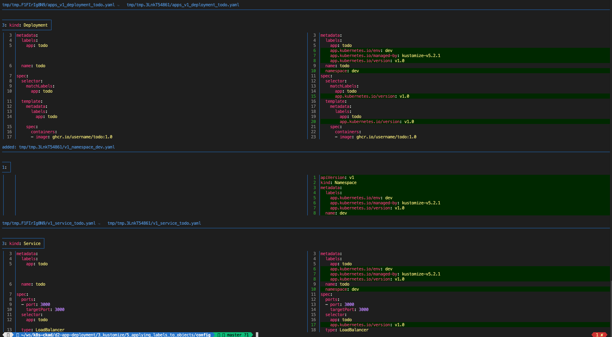

# Lab: Applying Labels to Objects in an Overlay

## Objectives

- Use **Kustomize** to add labels to the metadata of the example app's configuration in an overlay.
- Learn to apply both specific labels and common labels across various objects.
- Understand the usage of the LabelTransformer in Kustomize.

---

## Steps

### 1. Update the Overlay Kustomization
Navigate to the `overlay` directory and modify the `kustomization.yaml` file to include label-related configurations.

```bash
cd config/overlay
```

The `kustomization.yaml` should look like this:

```yaml
apiVersion: kustomize.config.k8s.io/v1beta1
kind: Kustomization
resources:
  - ../base
  - namespace.yaml
buildMetadata:
  - managedByLabel
namespace: dev
labels:                              # Added
  - pairs:                           # Added
      app.kubernetes.io/env: dev     # Added
commonLabels:                        # Added
  app.kubernetes.io/version: v1.0    # Added
```

---

### 2. Create Temporary Directories for Output
Create temporary directories to store the rendered outputs for the base and overlay builds.

```bash
cd ..
BASE="$(mktemp -d -p /tmp)"
OVERLAY="$(mktemp -d -p /tmp)"
```

---

### 3. Build the Base and Overlay Kustomizations
Run the `kustomize build` command for both the base and overlay configurations, saving the outputs to their respective temporary directories.

```bash
kustomize build base -o $BASE
kustomize build overlay -o $OVERLAY
```

---

### 4. Compare the Outputs
Use a diffing tool like [delta](https://dandavison.github.io/delta/installation) to compare the two builds. This will help confirm that labels have been added appropriately.

```bash
delta -s $BASE $OVERLAY
```

You should see something like this


Focus on verifying:
- Labels added to `metadata` fields.
- Labels applied to `template` and `selector` fields in Deployment and Service objects.

---

## Summary

In this lab, you:
- Applied the **LabelTransformer** in Kustomize to add specific and common labels.
- Verified how the labels were applied to different fields in various Kubernetes resources.

### Next Steps:
Try extending this lab by:
- Experimenting with built-in transformers to selectively apply labels to specific objects.
- Applying additional transformations to fine-tune your configurations.
